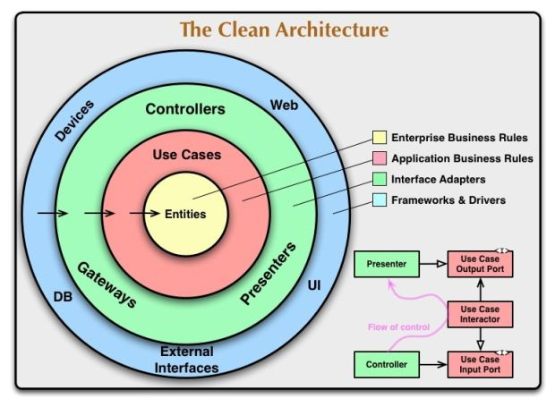
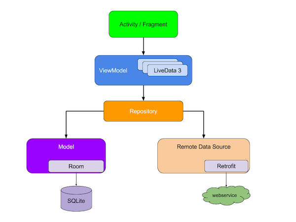
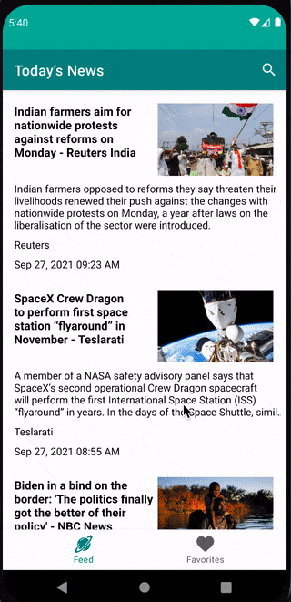

# Android - Clean Architecture - Kotlin
The purpose of this repo is to follow up Clean Architecture principles by bringing them to Android. The repo contains a Sample News Application which shows current news from https://newsapi.org/ API.

## Clean Architecture

Clean architecture promotes separation of concerns, making the code loosely coupled. This results in a more testable and flexible code. This approach divides the project into 3 modules: presentation, data, and domain.



* __Presentation__: Layer with the Android Framework, the MVVM pattern and the DI module. Depends on the domain to access the use cases and on di, to inject dependencies.
* __Domain__: Layer with the business logic. Contains the use cases, in charge of calling the correct repository or data member.
* __Data__: Layer with the responsibility of selecting the proper data source for the domain layer. It contains the implementations of  the repositories declared in the domain layer. It may, for example, check if the data in a database is up to date, and retrieve it from service if it’s not.

## Functionality
The app's functionality includes:
1. Fetch Current News data from https://newsapi.org/ & show them in `RecylerView` with smooth pagination.
2. When an item is selected from `RecyclerView` it will load the news article in a `Webview`.
3. From Details view , a news article can be added to Favorite news - which will store the News article in the Room database.
4. From Today's news section users can search for specific news topic & return the search results with pagination.
5. From favorite news section users can view all their saved news articles, they can also swipe left/right to delete the article from local database.

## Architecture
The app uses clean architecture with `MVVM(Model View View Model)` design pattern. 
MVVM provides better separation of concern, easier testing, Live data & lifecycle awareness, etc.



### UI
The UI consists of two parts
1. `View` - Activity screen, Host the navigation component fragments.
2. `Fragment` - Contains two fragments:

    a) `FeedFragement` - Show & search for today's news. Listen for `onScrollListener` using `EndlessRecyclerOnScrollListener` for Recylcerview.

    b) `FavoriteFragment` - Show saved news articles.

    c) `DetailsFragment` - Show webview with floating action button for loading & saving news article.

### Model
Model is generated from `JSON` data into a Kotlin data class.
In addition entity class has been added for room database along with `Type converter` for saving/retrieving custom object data.

### ViewModel

`MainViewModel.kt`

Used for fetching today's news, searching news & update livedata. Also send out the status of the network call like Loading, Success, Error using `sealed` class.

The `ViewModel` also responsible for pagination of data using page count.


### Dependency Injection
The app uses `Dagger-hilt` as a dependency injection library.

The `ApplicationModule.kt` class provides  `Singleton` reference for `Retrofit`, `OkHttpClient`, `Repository` etc.

### Network
The network layer is composed of Repository, ApiService.
`NewsApi` - Is an interface containing the suspend functions for retrofit API call.

`NewsRepository` - Holds the definition of the remote/local repository call.

## Building

In-order to successfully run & test the application you will need an `api key`.

Go to - **https://newsapi.org/**  and click `Get Api Key`

Now Go to - `app/src/main/java/utils/Constants.kt`

And replace

`const val API_KEY = "YOUR_API_KEY"`

You can open the project in Android studio and press run.
Android Studio version used to build the project: Arctic fox 2020.3.1

Gradle plugin used in the project will require `Java 11.0` to run.

you can set the gradle jdk in `Preferences->Build Tools->Gradle->Gradle JDK`

The project uses [`Kotin-Dsl`](https://docs.gradle.org/current/userguide/kotlin_dsl.html) build scripts to maintain dependencies & plugins.

## Tech Stack
1.  [Android appcompat](https://developer.android.com/jetpack/androidx/releases/appcompat), [KTX](https://developer.android.com/kotlin/ktx), [Constraint layout](https://developer.android.com/reference/androidx/constraintlayout/widget/ConstraintLayout), [Material Support](https://material.io/develop/android/docs/getting-started).
2.  [Android View Binding](https://developer.android.com/topic/libraries/view-binding)
3. [Hilt](https://developer.android.com/training/dependency-injection/hilt-android) for dependency injection.
4. [Retrofit](https://square.github.io/retrofit/) for REST API communication
5. [Coroutine](https://developer.android.com/kotlin/coroutines) for Network call
6. [Lifecycle](https://developer.android.com/jetpack/androidx/releases/lifecycle), [ViewModel](https://developer.android.com/topic/libraries/architecture/viewmodel)
7. [LiveData](https://developer.android.com/topic/libraries/architecture/livedata)
8. [Room](https://developer.android.com/jetpack/androidx/releases/room) for local database.
9. [Navigation Component](https://developer.android.com/guide/navigation/navigation-getting-started) for supporting navigation through the app.
10. [Glide](https://github.com/bumptech/glide) for image loading.
11. [Swipe Refresh Layout](https://developer.android.com/jetpack/androidx/releases/swiperefreshlayout) for pull-to-refresh `RecyclerView`.
12. [EndlessRecyclerOnScrollListener](https://gist.github.com/rafsanahmad/00214d0f2879884513f8e086754a22e7) for Recylerview Infinite Scroll.
13. [Mockito](https://developer.android.com/training/testing/local-tests) & [Junit](https://developer.android.com/training/testing/local-tests) for Unit testing.
14. [Robolectric](http://robolectric.org/) for Instrumentation testing.
15. [Truth](https://truth.dev/) for Assertion in testing.
16. [Espresso](https://developer.android.com/training/testing/espresso) for UI testing.

## Testing

Unit testing has been added for `MainViewModel` & `NewsRepository`.

### `MainViewModelTest.kt`

Test the viewmodel of the app using `CoroutineRule` & `LiveData Observer`.

The test cases comprise of testing different states like Loading, Success, Error with fake data for testing News Response & Search Response.

### `NewsRepositoryTest.kt`

Test the Repository of the app using `Robolectric`.

The test comprises of testing the functionality of Favorite News Room Database like Insertion, Remove, Get saved news etc.

[Mock Webserver](https://github.com/square/okhttp/tree/master/mockwebserver) is used to test the Network api response in case of successful data, empty, failed case.

## Sample app



## License

```
Copyright (c) 2021 Rafsan Ahmad

Permission is hereby granted, free of charge, to any person obtaining a copy
of this software and associated documentation files (the "Software"), to deal
in the Software without restriction, including without limitation the rights
to use, copy, modify, merge, publish, distribute, sublicense, and/or sell
copies of the Software, and to permit persons to whom the Software is
furnished to do so, subject to the following conditions:

The above copyright notice and this permission notice shall be included in all
copies or substantial portions of the Software.

THE SOFTWARE IS PROVIDED "AS IS", WITHOUT WARRANTY OF ANY KIND, EXPRESS OR
IMPLIED, INCLUDING BUT NOT LIMITED TO THE WARRANTIES OF MERCHANTABILITY,
FITNESS FOR A PARTICULAR PURPOSE AND NONINFRINGEMENT. IN NO EVENT SHALL THE
AUTHORS OR COPYRIGHT HOLDERS BE LIABLE FOR ANY CLAIM, DAMAGES OR OTHER
LIABILITY, WHETHER IN AN ACTION OF CONTRACT, TORT OR OTHERWISE, ARISING FROM,
OUT OF OR IN CONNECTION WITH THE SOFTWARE OR THE USE OR OTHER DEALINGS IN THE
SOFTWARE.
```
